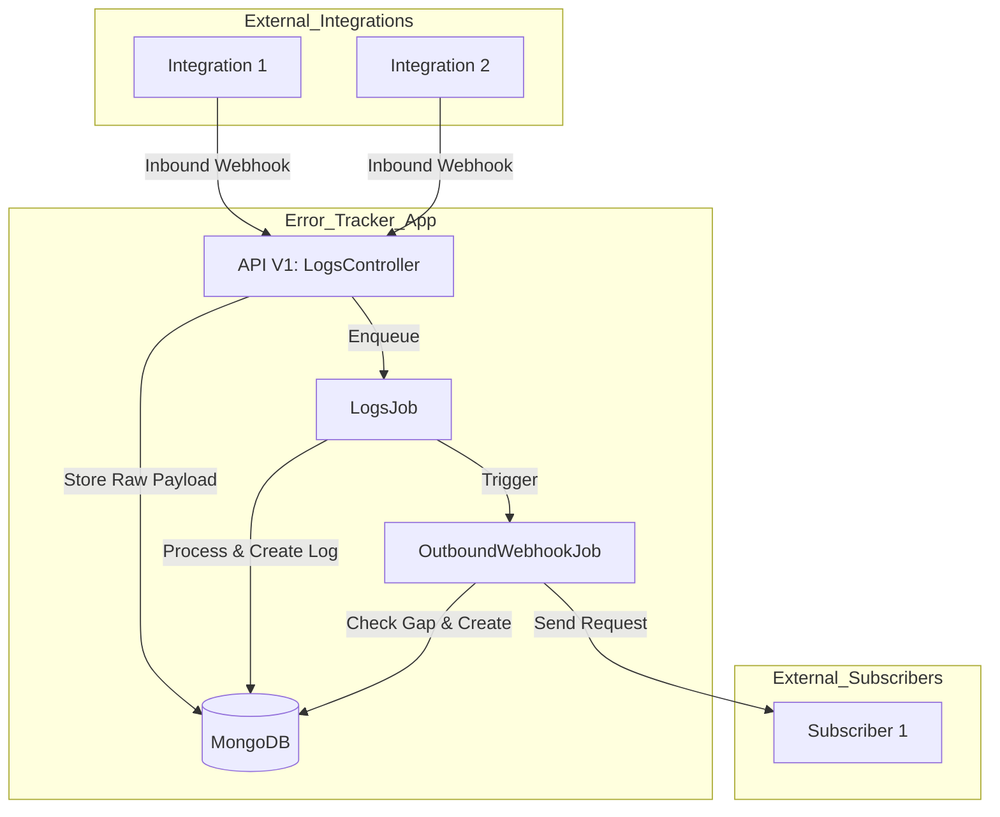
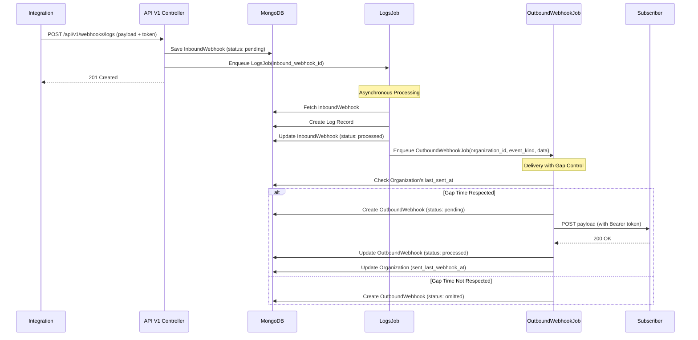

# R&D Document: Error Tracker Webhook System

## Software Architecture

### Overview
The Error Tracker system is a Ruby on Rails application designed to collect logs from various integrations and notify subscribers via webhooks. It uses MongoDB as its primary data store and follows a decoupled architecture using background jobs for asynchronous processing.

### Sequence Diagram: Webhook Flow

### Key Components

1.  **Inbound Webhooks (API V1):**
    *   **Controllers:** `Api::V1::Webhooks::LogsController` (and other resource-specific controllers).
    *   **Authentication:** Bearer token authentication via `public_secret` of the `Integration` model. In production, it also verifies the `Origin` header.
    *   **Rate Limiting:** Implemented at the controller level with both burst (3 requests/6 seconds) and sustained (100 requests/hour) controls using Rails cache.
    *   **Persistence:** Incoming raw payloads are stored in `InboundWebhook` documents.

2.  **Background Processing:**
    *   **LogsJob:** Processes `InboundWebhook` records, extracting data and creating `Log` entries associated with `Organization`, `Project`, and `Integration`.
    *   **OutboundWebhookJob:** Triggered by events (e.g., model callbacks or service calls). It checks if an organization is subscribed to the specific event and schedules an `OutboundWebhook`.

3.  **Outbound Webhooks:**
    *   **Model:** `OutboundWebhook` manages the lifecycle of a notification (pending, processed, omitted, error).
    *   **Delivery:** `OutboundWebhook#send_request!` handles the actual HTTP request to the subscriber's origin. It includes custom headers like `X-Rails-Webhook-Gap` for delivery management.
    *   **Gap Control:** To prevent overwhelming subscribers, a `GAP_TIME` (5 seconds) is enforced between consecutive webhooks for the same organization. If a webhook is triggered too soon, it is marked as `OMITTED`.

4.  **Data Model (MongoDB/Mongoid):**
    *   `Organization`: Owns projects and integrations. Configures webhook subscriptions.
    *   `Project`: Belongs to an organization.
    *   `Integration`: Belongs to a project. Provides the secret for inbound authentication.
    *   `Log`: Records of errors/events collected from integrations.
    *   `InboundWebhook`: Audit log of raw data received.
    *   `OutboundWebhook`: History of notifications sent.

---

## Risk Analysis

### 1. Delivery Failures and Reliability
*   **Risk:** Outbound webhooks may fail due to subscriber downtime, network issues, or misconfiguration.
*   **Current State:** The system marks failed attempts as `ERROR` and stores the response code. However, there is no automatic retry mechanism (exponential backoff) implemented in the current `OutboundWebhook` model.
*   **Mitigation:** Implement a retry strategy using sidekiq/active_job retries and store the attempt count.

### 2. Security and Authentication
*   **Risk:** Unauthorized parties could send fake log data or intercept webhook notifications.
*   **Current State:** 
    *   Inbound: Uses token authentication and origin verification (in production).
    *   Outbound: Uses a `Bearer` token (`organization.public_secret`) in the header.
*   **Mitigation:** Encourage use of HTTPS for all subscriber endpoints. Consider signing webhook payloads with a HMAC signature so subscribers can verify the sender.

### 3. Rate Limiting and Denial of Service (DoS)
*   **Risk:** Malicious or misconfigured integrations could flood the API with requests, exhausting system resources.
*   **Current State:** Basic rate limiting is in place using Rails cache.
*   **Mitigation:** Use a more robust rate-limiting backend (like Redis) if the system scales. Ensure rate limits are tuned per integration level rather than just IP-based if needed.

### 4. Data Consistency and Race Conditions
*   **Risk:** Rapidly occurring events might lead to race conditions when updating `sent_last_webhook_at` or checking the `GAP_TIME`.
*   **Current State:** `OutboundWebhookJob` performs a check and update on the organization. MongoDB's atomic operations help, but overlapping job executions could still lead to multiple webhooks being sent within the gap time if not handled carefully.
*   **Mitigation:** Use distributed locks or atomic `find_and_modify` operations to ensure strict adherence to the gap time.

### 5. Scalability of Webhook Delivery
*   **Risk:** A large number of events across many organizations could saturate the background job workers.
*   **Current State:** Webhooks are sent synchronously within the `OutboundWebhookJob`.
*   **Mitigation:** Ensure the `OutboundWebhook#send_request!` has strict timeouts (currently 5s) to prevent blocking workers. Consider a dedicated queue for outbound webhooks to isolate them from other background tasks.
